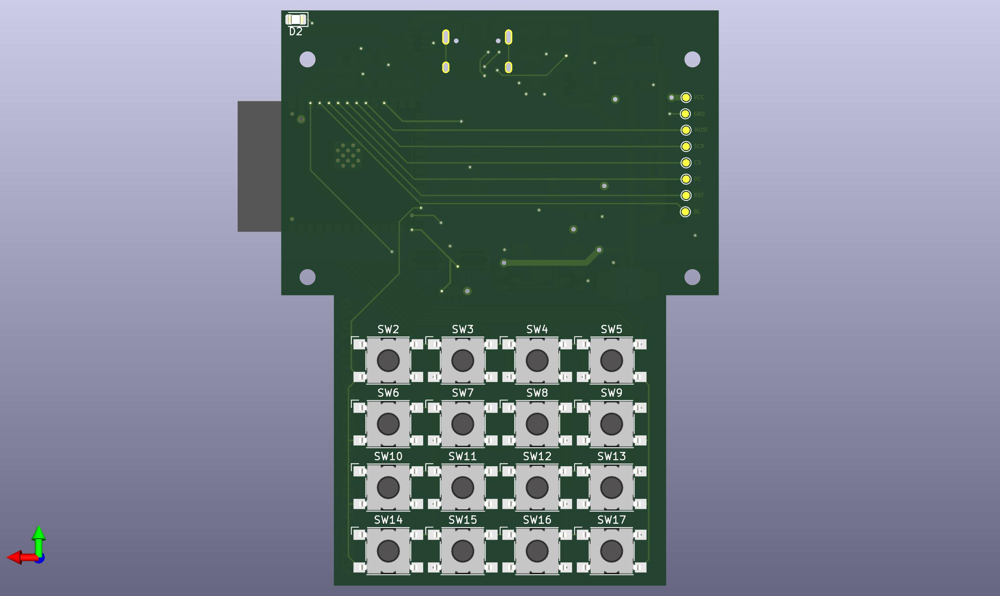
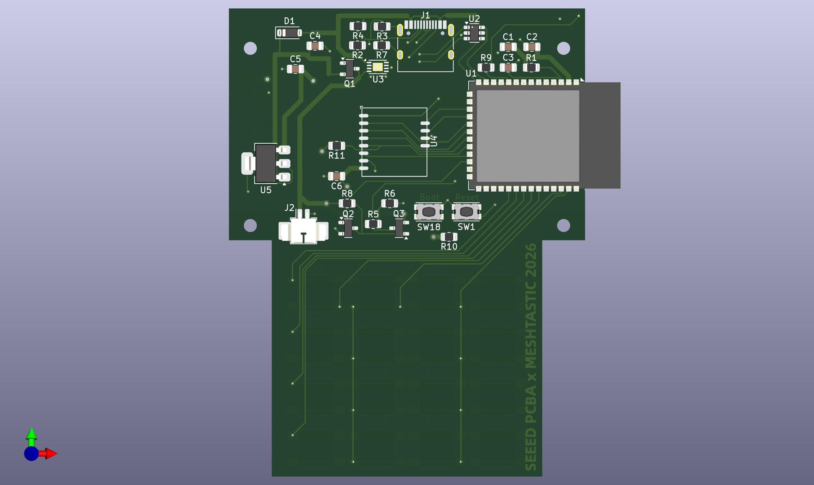
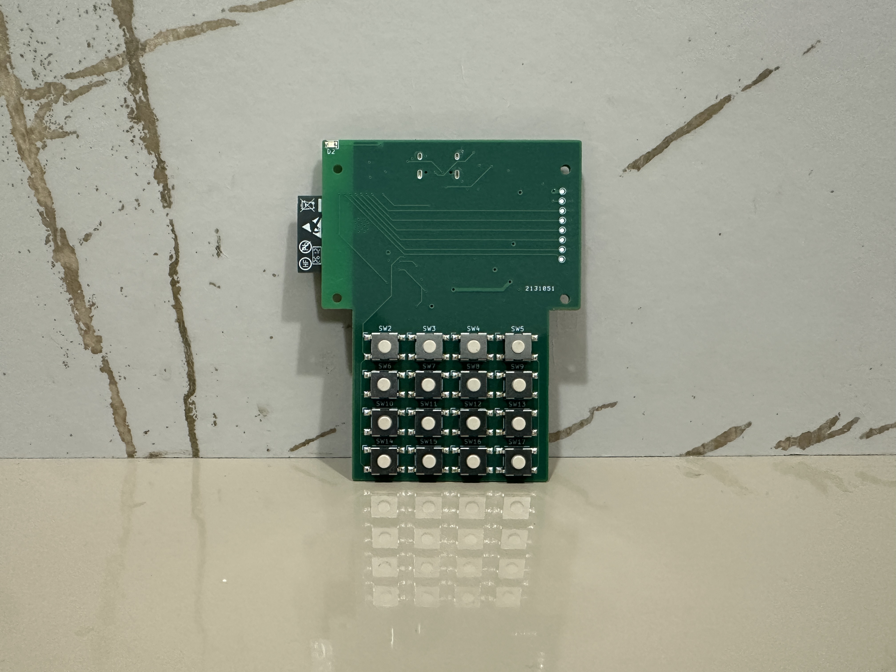
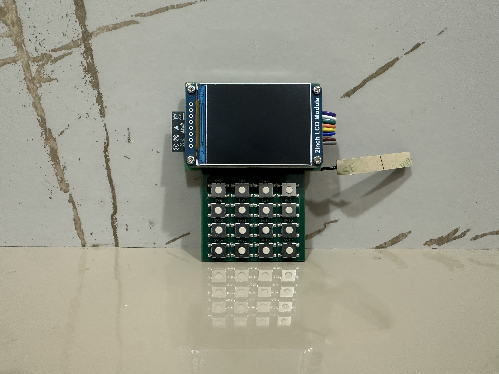
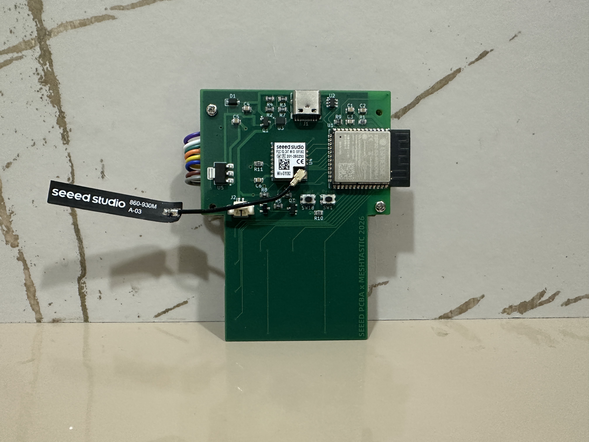
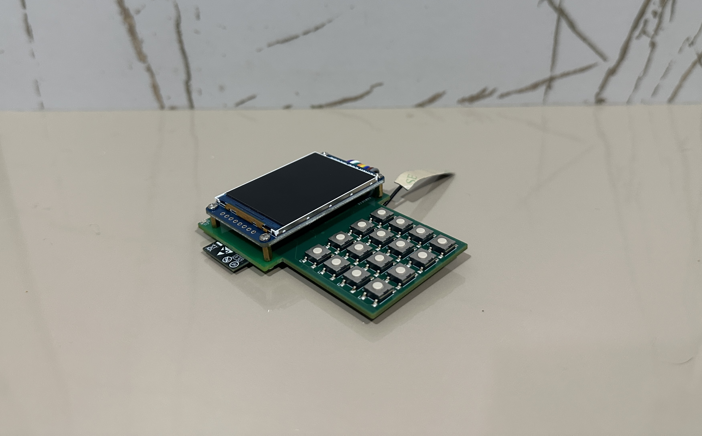

# MESHTASTIC Build-Off 2026 - Hardware Design

## Project Overview

This directory contains the custom hardware design for the **MESHTASTIC Build-Off 2026** competition entry. The goal is to create a custom PCB-based Meshtastic device with integrated display and keypad interface.

## PCB Renders

<table>
<tr>
<td width="50%">

**Front**

</td>
<td width="50%">

**Back**

</td>
</tr>
</table>

## Device Photos

### Assembled Device

<table>
<tr>
<td width="50%">

</td>
<td width="50%">

</td>
</tr>
<tr>
<td width="50%">

</td>
<td width="50%">

</td>
</tr>
</table>

## Device Demonstration

### Video Walkthrough

**[▶️ Click to watch the full device demonstration on Google Drive](https://drive.google.com/file/d/14EuYKU1ftvDvArWkbm3pBw8lZNBgqO2j/view)**

*Device demonstration showing the T9 interface, messaging, and LoRa mesh functionality*

## Competition Entry

- **Event:** MESHTASTIC Build-Off 2026
- **Category:** Custom Hardware Design
- **Project Status:** Complete - Ready for Competition

## Hardware Specifications

### Core Components

- **Microcontroller:** ESP32-S3
  - Dual-core processor
  - Built-in WiFi support
  - Low power consumption
  - Ample GPIO for peripherals

- **LoRa Module:** Wio-SX1262 Wireless Module
  - Sub-GHz LoRa transceiver
  - Long-range mesh networking capability
  - Optimized for low power operation

### Peripheral Integration

- **Display:** TFT ST7789 (240x320 pixels)
  - Custom UI with LoRa network visualization
  - Message management interface
  - Battery and signal indicators

- **Input:** 4x4 Matrix Keypad
  - T9 text input system
  - Navigation and control keys
  - Efficient one-handed operation

- **Power Management:**
  - LiPo battery support with charging circuit
  - Power monitoring and low-battery alerts
  - Optimized sleep modes

## Design Goals

1. **Integration:** Single PCB design combining all components
2. **Efficiency:** Low power consumption for extended battery life
3. **Usability:** Intuitive keypad-based interface
4. **Reliability:** Robust design suitable for outdoor/field use
5. **Compliance:** Meet MESHTASTIC Build-Off 2026 requirements

## Development Phases

### Phase 1: PCB Design ⚡ (Completed)
- [x] Schematic design (Done Jun 19, 2026)
- [x] Component selection and sourcing (Done Jun 19, 2026)
- [x] PCB layout and routing (Done Jun 19, 2026)
- [x] Power circuit design (Done Jun 19, 2026)
- [x] Antenna integration planning (Done Jun 19, 2026)

### Phase 2: Firmware Adaptation 🔧 (Completed)
- [x] Port custom UI to new hardware (Done Aug 2026)
- [x] Update pin configurations (Done Aug 2026)
- [x] Test and optimize power management (Done Aug 2026)
- [x] Create custom variant configuration (Done Aug 2026)

### Phase 3: Testing & Validation ✅ (Completed)
- [x] Prototype assembly and bring-up (Done Aug 2026)
- [x] Hardware functionality testing (Done Aug 2026)
- [x] Range and mesh network testing (Done Aug 2026)
- [x] Power consumption analysis (Done Aug 2026)
- [x] Field testing and optimization (Done Aug 2026)

## Bill of Materials (BOM)

| Order | Reference | MPN/SKU | Quantity | Unit Cost | Description |
|-------|-----------|---------|----------|-----------|-------------|
| 1 | C2, C3, C6 | 302010165 | 3 | $0.06 | Capacitors |
| 2 | R9 | 301010367 | 1 | $0.01 | Resistor |
| 3 | R7 | 301010680 | 1 | $0.01 | Resistor |
| 4 | R2, R3 | 301012180 | 2 | $0.01 | Resistors |
| 5 | R1, R10, R11 | 301010361 | 3 | $0.01 | Resistors |
| 6 | R4, R6, R8 | 301010396 | 3 | $0.01 | Resistors |
| 7 | R5 | RC0805FR-07390KL | 1 | $0.23 | 390K Resistor |
| 8 | C1, C4, C5 | 302010361 | 3 | $0.05 | Capacitors |
| 9 | Q1, Q3 | 305031702 | 2 | $0.30 | Transistors |
| 10 | Q2 | 305030028 | 1 | $0.13 | Transistor |
| 11 | U5 | AP7361C-33E-13 | 1 | $2.20 | 3.3V Voltage Regulator |
| 12 | J2 | 53261-0271 | 1 | $0.98 | Connector |
| 13 | D1 | 304020028 | 1 | $0.40 | Diode |
| 14 | U1 | ESP32-S3-WROOM-1-N16R8 | 1 | $6.35 | ESP32-S3 MCU (16MB Flash, 8MB PSRAM) |
| 15 | D2 | 17-215/GHC-YR1S2/3T | 1 | $2.32 | LED |
| 16 | U3 | MCP73831T-2ACI/MC | 1 | $1.18 | Li-Po Battery Charger IC |
| 17 | SW2-SW17 | B3FS-1002P | 16 | $0.83 | Tactile Switches (4x4 Keypad) |
| 18 | SW1, SW18 | KMR221G LFS | 2 | $3.13 | Tactile Switches (Reset/Boot) |
| 19 | J1 | 320010859 | 1 | $0.75 | Connector (USB-C) |
| 20 | U2 | USBLC6-2SC6 | 1 | $2.59 | USB ESD Protection IC |
| 21 | U4 | 114993390 | 1 | $21.45 | LoRa Module/Display Module |

### Additional Components (Not in PCB Assembly)

| Component | Description | Quantity | Notes |
|-----------|-------------|----------|-------|
| **Display** | ST7789 TFT LCD 240x320 | 1 | 2.4" color display |
| **Battery** | Li-Po 3.7V 2000mAh | 1 | Rechargeable battery |
| **Antenna** | 868/915MHz LoRa Antenna | 1 | External SMA or U.FL |

### Cost Summary

- **PCB Components:** ~$98.88 per unit (based on 5-unit order)
- **Additional Parts:** ~$15-25 (display, battery, antenna, enclosure)
- **PCB Manufacturing:** ~$10-20 per unit (depending on quantity)
- **Assembly:** DIY or ~$30-50 professional assembly

**Total Estimated Cost per Unit:** ~$124-194

*Note: Prices based on small quantity orders (5 units). Costs decrease significantly with larger production runs.*

---

**Competition Preparation Status:** Complete  
**Last Updated:** August 2026
